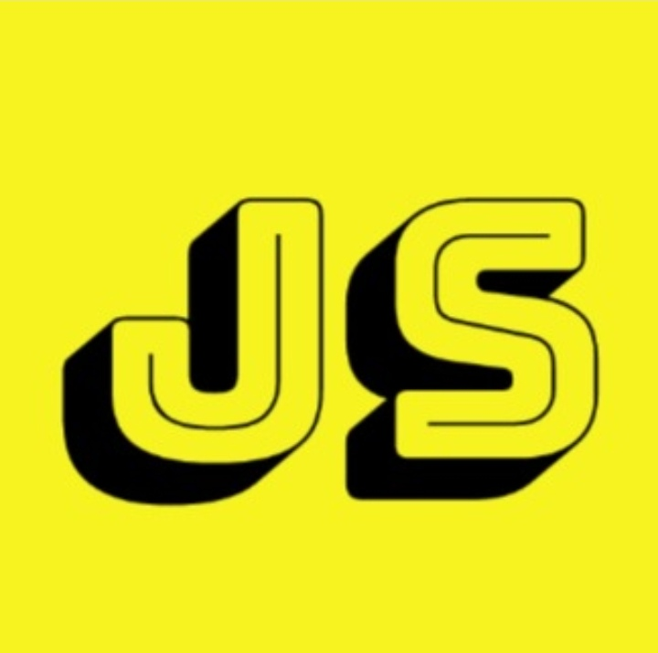

<!-- PROJECT LOGO -->
<br />
<p align="center">
  <a href="https://github.com/baliksjosay/javascript-kampala-site">
    
  </a>

  <h3 align="center">Javascript Kampala Website</h3>

  <p align="center">
    Learning platform
    <br />
    <a href="#"><strong>Explore the docs »</strong></a>
    <br />
    <br />
    <a href="https://gdexpertsuganda.web.app/">View Demo</a>
    ·
    <a href="https://github.com/baliksjosay/javascript-kampala-site/issues">Report Bug</a>
    ·
    <a href="https://github.com/baliksjosay/javascript-kampala-site/issues">Request Feature</a>
  </p>
</p>

<!-- TABLE OF CONTENTS -->
<details open="open">
  <summary>Table of Contents</summary>
  <ol>
    <li>
      <a href="#about-the-project">About The Project</a>
      <ul>
        <li><a href="#built-with">Built With</a></li>
      </ul>
    </li>
    <li>
      <a href="#getting-started">Getting Started</a>
      <ul>
        <li><a href="#prerequisites">Prerequisites</a></li>
        <li><a href="#installation">Installation</a></li>
      </ul>
    </li>
    <li><a href="#usage">Usage</a></li>
    <li><a href="#roadmap">Roadmap</a></li>
    <li><a href="#contributing">Contributing</a></li>
    <li><a href="#license">License</a></li>
    <li><a href="#contact">Contact</a></li>
    <li><a href="#acknowledgements">Acknowledgements</a></li>
  </ol>
</details>

<!-- ABOUT THE PROJECT -->
## About The Project

The best modern website for GDEXperts

Here's why its good:
* build with graphQL and gatsby
* Manageable site content
* Very fast and efficient :smile:

A list of commonly used resources that I find helpful are listed in the acknowledgements.

### Built With

This section should list any major frameworks that you built your project using. Leave any add-ons/plugins for the acknowledgements section. Here are a few examples.
* [React](https://reactjs.org/tutorial/tutorial.html)

<!-- GETTING STARTED -->
## Getting Started

This is how you can set up your project locally.
To get a local copy up and running follow these simple example steps.

### Prerequisites

This is an example of how to list things you need to use the software and how to install them.
* npm
  ```sh
  npm install npm@latest -g
  ```

### Installation

1. Clone the repo
   ```sh
   git clone https://github.com/baliksjosay/javascript-kampala-site.git
   ```
2. Install NPM packages
   ```sh
   npm install
   ```
3. Start Project 
   ```sh
   npm start
   ```
4. Buld Project
   ```sh
   npm build
   ```
<!-- USAGE EXAMPLES -->
## Usage

Javascript kampala community site
_ refer to the [Documentation](https://javascriptkampala.web.app)_

<!-- ROADMAP -->
## Roadmap

See the [open issues](https://github.com/baliksjosay/javascript-kampala-site/issues) for a list of proposed features (and known issues).

<!-- CONTRIBUTING -->
## Contributing

Contributions are what make the open source community such an amazing place to be learn, inspire, and create. Any contributions you make are **greatly appreciated**.

1. Fork the Project
2. Create your Feature Branch (`git checkout -b feature/AmazingFeature`)
3. Commit your Changes (`git commit -m 'Add some AmazingFeature'`)
4. Push to the Branch (`git push origin feature/AmazingFeature`)
5. Open a Pull Request

<!-- LICENSE -->
## License

Distributed under the MIT License. See `LICENSE` for more information.

<!-- CONTACT -->
## Contact

Joseph Balikuddembe - [@baliksjoseph](https://twitter.com/baliksjoseph) - baliksjosay@gmail.com

Project Link: [https://github.com/baliksjosay/javascript-kampala-site](https://github.com/baliksjosay/javascript-kampala-site)


